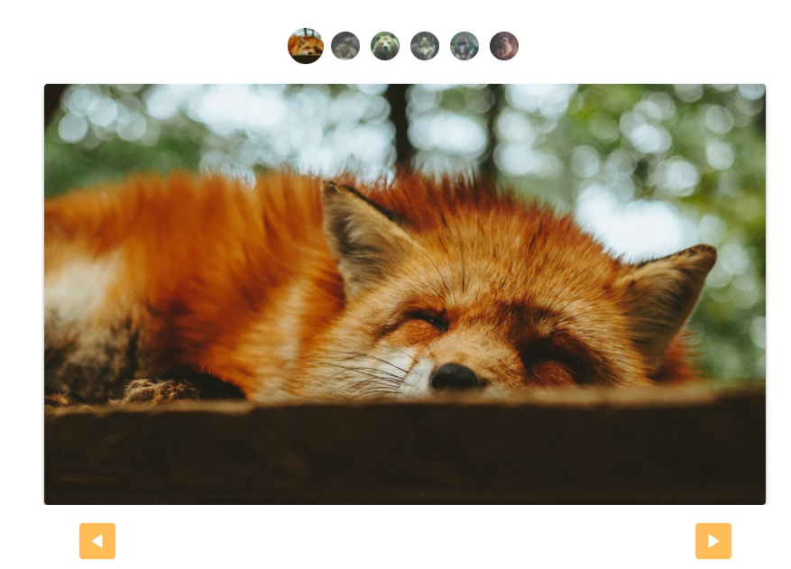

<h1 align="center">Slide com Javscript Puro</h1>

  

<h3 align="center">O projeto é um slide feito do zero usando apenas javascript puro.</h3>

  

## 📄 Licença

Esse projeto está sob a licença MIT. Veja o arquivo [LICENSE](LICENSE) para mais detalhes.
